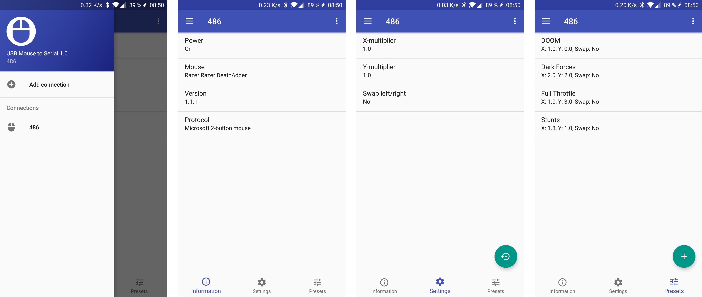

# USB Mouse to Serial Configuration
Android app to configure USB Mouse to Serial remotely using the Remote Configuration API.

## Download
The app can be downloaded from the [releases](https://github.com/mborjesson/USB-Mouse-to-Serial-Configuration-Android/releases) page.
